# 🖨️ VijayFlex Pro

### A complete shop management system built for real printing-shop workflows

**Orders • Billing • Payments • Inventory • Employees • Accounts — all in one place**


---

## 📖 About

**VijayFlex Pro** was built for **Vijay Flex & Offset**, a printing shop in Pilibangan, Rajasthan, to replace a fragmented, paper-based system: a separate order register, a daily ledger for sales/expenses, and manual notes for customer dues — all kept in different places.

That setup created real, recurring problems:

- Cash and online payments had to be written down separately, then reconciled by hand.
- Customer dues lived in someone's memory or a notebook, so follow-ups were late — and by the time payment was actually requested, the customer had often already moved on to other work.
- Finding a specific pending order meant flipping through the entire order book.
- There was no single source of truth — the same information (a payment, an order, a due amount) had to be written in three or four different places, and any mismatch between them was a mismatch nobody would notice until it was too late.

VijayFlex Pro was designed around one core principle:

> **"A single wrong due or amount can destroy a customer's trust."**

Every feature — from the recycle bin to cheque tracking to password-gated ledger edits — exists to make sure that never happens.

---

## ✨ Key Features

### 🧾 Orders & Billing
- Create orders with multiple line items (size/L×B calculator, quantity, rate, auto subtotal)
- Track advance payment, discount/round-off, and balance due — all computed live
- Generate branded, print-ready PDF invoices in one click
- Order status pipeline: Pending → In Progress → Ready → Delivered
- Follow-up date system — set a reminder date for when a customer is expected to pay
- Full activity log per order, including every payment request sent

### 👥 Customers & CRM
- Per-customer profile with total billed, total paid, and total due at a glance
- Multi-order account statements — one PDF that summarizes every order, payment, and cheque for a customer
- One-click WhatsApp delivery of invoices, statements, and payment requests
- Opening balance support for onboarding existing customers with pre-existing dues

### 💳 Payments & Accounts
- UPI QR generation from any of multiple pre-configured UPI IDs, sent directly with the bill — with the due amount pre-filled and non-editable
- Payment links for larger dues (e.g. ≥ ₹2,000), also with the amount locked in
- Cheque Register with a full lifecycle: Received → In Bank → Cleared / Bounced
  - A cheque is **never counted toward a customer's balance until it clears** — so a bounced cheque never silently creates a wrong "due" anywhere in the system
- Vendor accounts for tracking purchases and payments to suppliers
- Commission tracking, fed automatically from daily expense entries, with a dedicated ledger view

### 💰 Daily Sales & Cash Management
- Daily Ledger — every day's income and expenses in one view (cash, UPI, cheque)
- Cash Drawer — opening balance carried forward automatically, with cash-in/cash-out breakdown and a computed closing balance
- Galla Hisaab (physical note-count reconciliation) — count actual notes in the drawer (₹500, ₹200, ₹100, …) and compare against the system's expected cash total, so shortfalls are caught the same day
- Expense entries by category, with cash-drawer impact tracked automatically

### 📦 Inventory Management
- Category-based stock tracking (Flex Rolls, Ink & Solvent, SunBoard, Chemicals, Photo Frames, and more)
- Fully custom categories — add a new stock type with its own unit and attributes without touching code
- Size/variant-level tracking (e.g. roll width × GSM)
- Low-stock alerts, surfaced directly on the dashboard

### 🧑‍💼 Employee Management
- Attendance marking (Present / Absent / Half Day) with a visual monthly calendar
- Automatic salary calculation based on present/absent/half days and per-day rate
- Salary crediting via cash or UPI, with full payment history per employee

### 📊 Reports
- Monthly P&L — income, expenses, net profit, and category-wise expense breakdown
- Yearly summary — month-by-month income/expense/profit table
- All Pending Dues report — every outstanding balance across all customers, sorted and filterable, with total outstanding shown up front

### 🔐 Data Safety & Trust
- Soft delete for customers and orders — deleted items go to a Recycle Bin and stay recoverable for 30 days before permanent deletion
- Password-protected deletion of ledger/payment entries — not everyone can rewrite financial history
- Page locks on sensitive sections (Accounts, Reports, Employees, Customer profiles)
- Login-gated app access
- Manual + scheduled automatic backups (daily, 11 PM)

### 🔔 One Entry, Everywhere
This is the design principle that ties the whole system together: record a payment **once**, and it automatically reflects in the customer's profile, the daily ledger, the cash drawer (if cash), the order's own payment history, and any relevant report — with zero duplicate data entry.

---

## 📸 Screenshots

**Login**

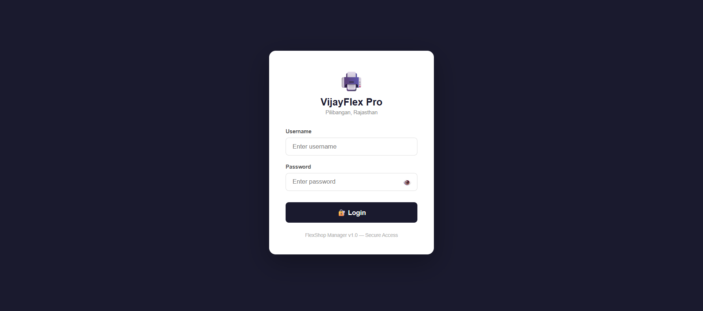

**Dashboard**

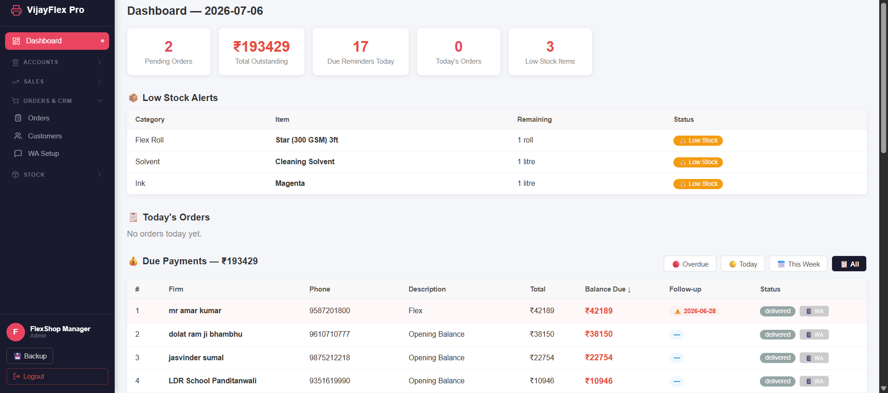

**Create Order**

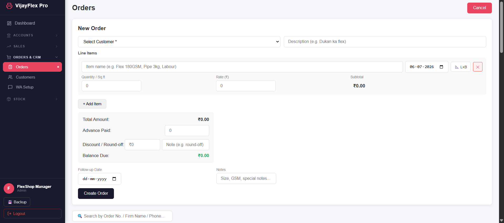

**Invoice PDF**

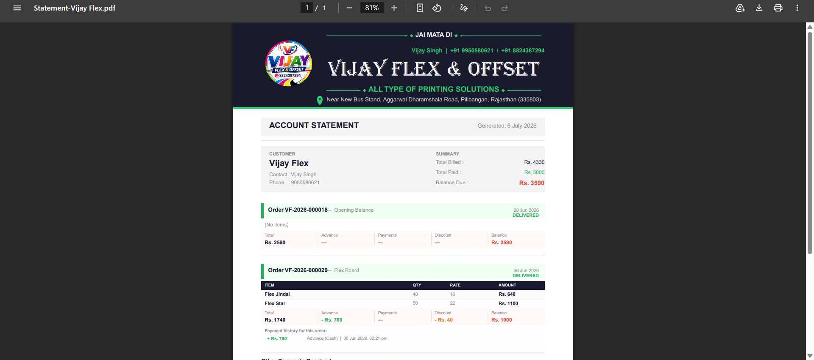

**Customer Profile**

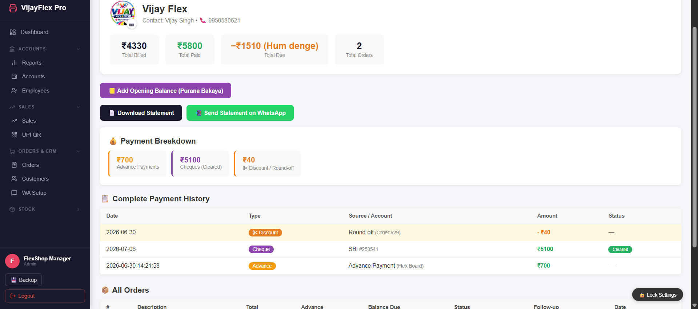

**WhatsApp Delivery**


**Cheque Register**

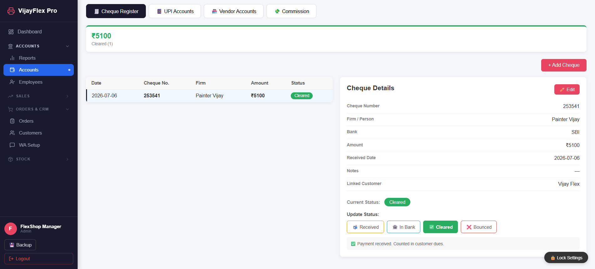

**UPI Accounts**

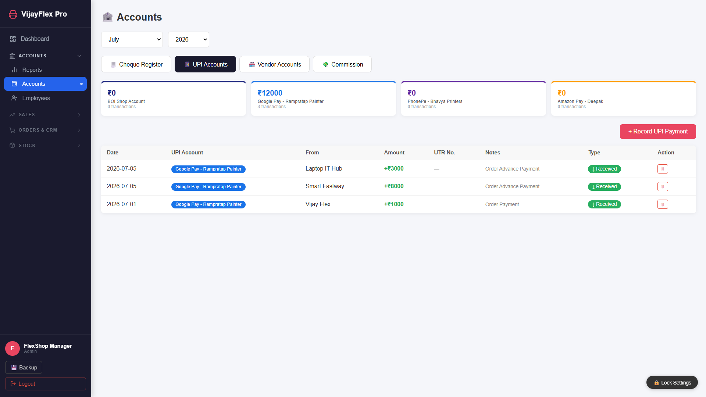

**Inventory**

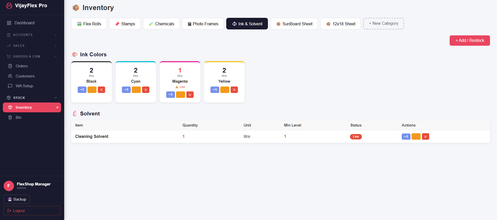

**Galla Hisaab (Cash Reconciliation)**

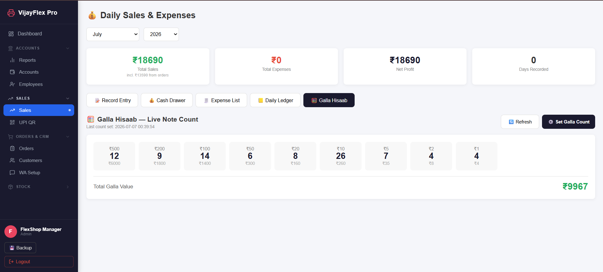

**Employees & Salary**

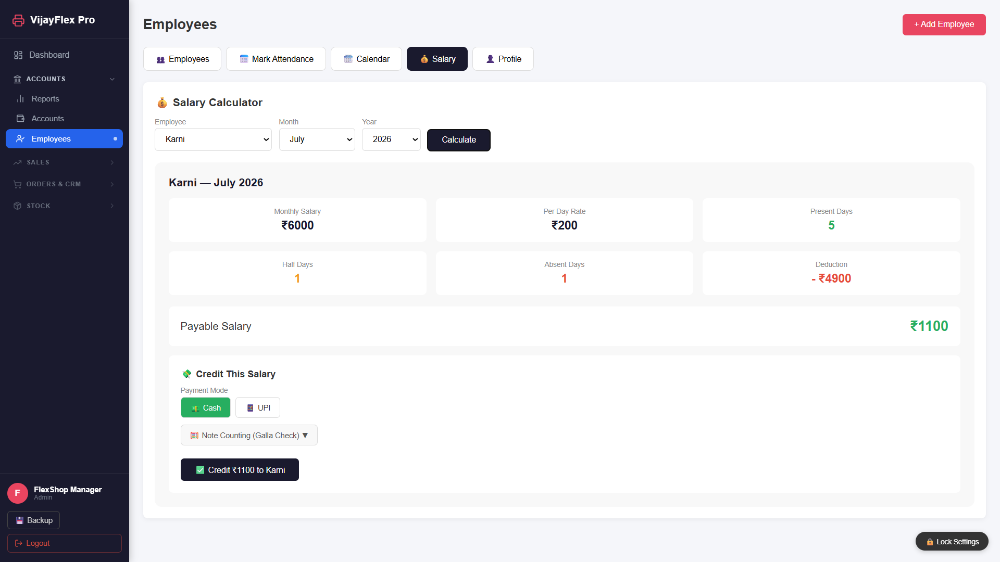

**Monthly P&L Report**

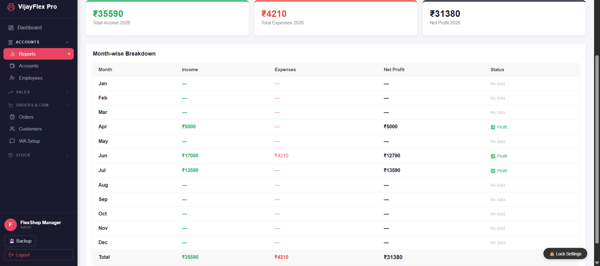

**Recycle Bin**

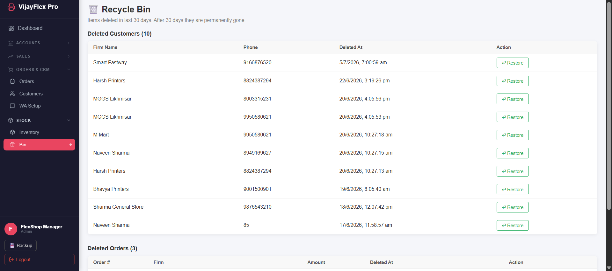

**Employees**

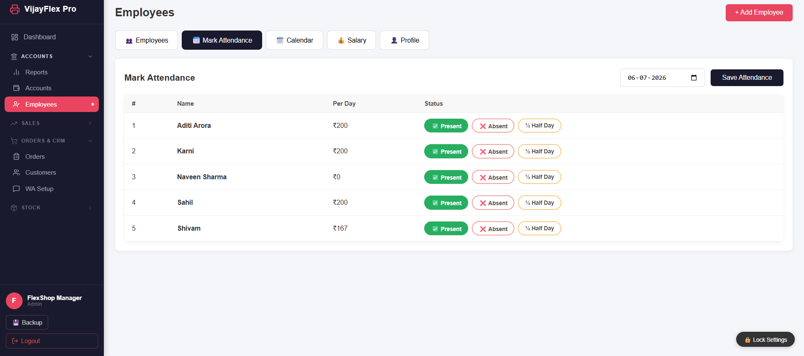

---

## 🛠️ Tech Stack

**Client**

| | |
|---|---|
| Framework | React 19 |
| Build tool | Vite |
| Routing | React Router v7 |
| HTTP | Axios |
| Icons | lucide-react |
| QR generation | qrcode |

**Server**

| | |
|---|---|
| Runtime | Node.js + Express |
| Database | SQLite3 (single-file, zero-config) |
| Auth | JSON Web Tokens + bcryptjs |
| File uploads | Multer |
| PDF generation | PDFKit |
| WhatsApp automation | whatsapp-web.js |
| Scheduled jobs | node-cron |
| Process management | PM2 |

---

## 🏗️ Architecture & Design Decisions

VijayFlex Pro is intentionally built as a **local-first, single-shop system** rather than a multi-tenant SaaS product, because that's what actually fits the problem it solves:

- **SQLite over a client-server database** — one shop, one machine, one dataset. SQLite gives a zero-config, single-file database that's trivial to back up (it's just a file) and requires no separate database server to install or maintain.
- **Runs on localhost, managed by PM2** — the app runs on the shop's own computer. This keeps all financial and customer data physically on-site rather than on third-party servers, with no ongoing hosting cost. A separate demo build is deployed on Vercel purely for showcasing the UI — the production app is not meant to be a hosted multi-user service.
- **whatsapp-web.js instead of the official WhatsApp Business API** — this was a deliberate cost/practicality trade-off. The official API is a paid product and requires a dedicated phone number that isn't linked to WhatsApp anywhere else — not a realistic ask for a small shop's existing number. whatsapp-web.js works with the shop's regular WhatsApp account at no extra cost, in exchange for being a community-maintained library rather than an official, guaranteed-stable API.

---

## 📁 Project Structure

```
flex-shop-manager/
├── client/                    # React frontend
│   └── src/
│       ├── components/        # Navbar, PageLock, BackupManager, DenominationCounter, ...
│       ├── pages/              # Dashboard, Orders, Customers, Accounts, Inventory, ...
│       └── services/           # API client
│
└── server/                    # Express backend
    ├── db/                     # SQLite database + schema
    ├── middleware/              # auth, upload
    ├── routes/                  # orders, customers, payments, cheques, upi, vendors,
    │                            # inventory, employees, whatsapp, pdf, backup, ...
    ├── assets/                  # invoice fonts, logo, watermark, signature
    ├── backups/                 # scheduled + manual backup snapshots
    ├── whatsapp.js               # WhatsApp session handling
    ├── backup.js                  # backup scheduler
    ├── ecosystem.config.js         # PM2 process configuration
    └── index.js                    # app entry point
```

---

## 🚀 Getting Started

### Prerequisites
- Node.js (v18+ recommended)
- npm

### 1. Clone the repository

```bash
git clone https://github.com/<your-username>/vijayflex-pro.git
cd vijayflex-pro
```

### 2. Set up the backend

```bash
cd server
npm install
```

Create a `.env` file inside `server/`:

```env
PORT=5000
JWT_SECRET=your_jwt_secret_here
```

Start the backend:

```bash
npm run dev        # development, with nodemon
# or
npm start          # production
```

On first run, scan the WhatsApp QR code from the WA Setup page in the app to link your WhatsApp account.

### 3. Set up the frontend

```bash
cd client
npm install
npm run dev
```

The app will be available at `http://localhost:5173` (frontend) with the API running on `http://localhost:5000`.

### 4. (Optional) Run with PM2 for production

```bash
cd server
pm2 start ecosystem.config.js
```

---

## 🔒 Security Notes

- Passwords are hashed with bcryptjs; sessions are authenticated via JWT.
- Sensitive pages (Accounts, Reports, Employees, Customer profiles) are individually lockable with a password, independent of the main login.
- Deleting entries from the daily ledger requires a separate password — this is intentionally more restrictive than regular navigation, since it touches financial history.
- This project is built for trusted, single-shop, local-network use. If you plan to expose it beyond localhost, review and tighten the CORS configuration and secrets management before doing so.

---

## 🗺️ Roadmap

- [ ] Environment variable template (`.env.example`) for easier onboarding
- [ ] WhatsApp connection health indicator on the dashboard
- [ ] Visual refresh pass on tables and data-dense views
- [ ] Automated pre-action backup snapshots (in addition to the daily scheduled backup)

---

## 📄 License

This project is licensed under the MIT License.

---

Built for **Vijay Flex & Offset** — Pilibangan, Rajasthan 🖨️